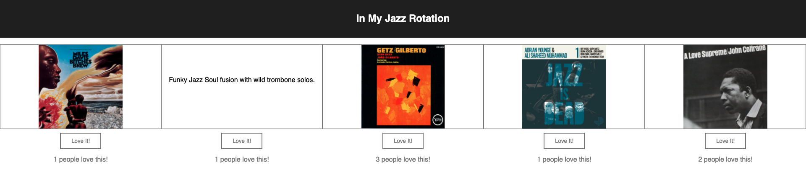

# React Gallery

## Description

_Duration: 1 Week_

This project was a culmination of my first week using React.  The user will presented with a series of images that are stored locally. When an image is clicked a description of the image will load. When the description is clicked the original photo will reload.  Below each image is a [Love It!] button that appears static keep the clean aesthetic.  When the mouse hovers over it will darken to show it's interactive.  When clicked the like count displayed below the button with increment by 1.

The data is stored locally in an array found within `modules/gallery.data.js`.

## Screen Shot

### Prerequisites

- [Node.js](https://nodejs.org/en/)

## Installation

1. Fork and clone project to local computer.
2. Open with the editor of your choice.
3. Add a few images to the `public/images` folder and modify the `server/modules/gallery.data.js` file.
4. Install nodemon using your terminal `npm install nodemon --global`.
5. Terminal `npm install`.
6. Terminal `npm run server`.
7. Open a separate terminal `npm run client`.
8. Nodemon will automatically load changes made
9. Control + C to stop server or client in their respected terminal.

## Usage

1. 5 images, album covers, will load
2. Click on any album cover and a description will appear in place of image.
3. Click on description and the album cover will reload.
4. If the user likes the album they can click the [Love It!] button.
5. Users can see how many people have loved the image or album in this case.

## Built With

- React
- Node.js
- Express.js
- Javascript
- HTML
- CSS

## Support

Please email me with suggestions stephen.r.piper@gmail.com